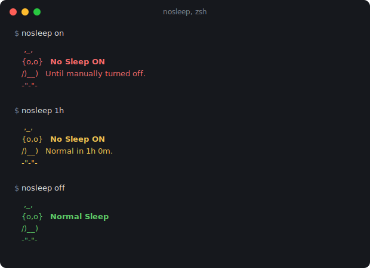

# nosleep 🦉

Keep your Mac awake **with the lid closed**, with an auto-off timer so you don't cook your backpack.

<p align="center">
  
</p>

## Why

Closing a MacBook's lid forces sleep; every process gets suspended, mid-build, mid-download, mid-agent-run. App-level tools like `caffeinate` and Amphetamine hold *idle-sleep* assertions, which macOS simply ignores on clamshell sleep (always, on battery; and without an external display or extra helpers, on AC too).

The only switch that actually wins is `pmset disablesleep`, a root-level setting that blocks **all** system sleep. It's also easy to leave on by accident, which is how MacBooks end up hot in bags. `nosleep` wraps it with a toggle, a status view, and a self-disarming timer.

### nosleep + Amphetamine: a companion, not a rival

[Amphetamine](https://apps.apple.com/us/app/amphetamine/id937984704) is the best everyday keep-awake app: menu-bar toggle, triggers, sessions, the works. But like `caffeinate`, it holds an *idle-sleep* assertion, and macOS drops that assertion the instant you close the lid. So no app-level tool can beat **clamshell** sleep, which is the one job `nosleep` exists to do.

Here's exactly what happens with the **lid closed**:

| Lid closed | macOS default | Amphetamine | nosleep |
|---|---|---|---|
| 🔌 AC + external display | ✅ stays awake | ✅ stays awake | ✅ stays awake |
| 🔌 AC, no display | ❌ sleeps | ⚠️ closed-display mode¹ | ✅ stays awake |
| 🔋 Battery + external display | ❌ sleeps | ❌ sleeps | ✅ stays awake |
| 🔋 Battery, no display | ❌ sleeps | ❌ sleeps | ✅ stays awake |

<sup>¹ Amphetamine's closed-display mode runs on AC power only, and its own docs warn it can overheat without an external display.</sup>

Notice Amphetamine tracks the **macOS default** almost exactly: it wins the top-left cell that macOS already handles, and the battery rows stay red no matter what. That's not a knock: with the lid *open*, Amphetamine is the tool to reach for. `nosleep` doesn't try to replace its triggers, sessions, or GUI.

**Use them together:** Amphetamine for the lid-open, plugged-in desk sessions; `nosleep` for the moment you close the lid and walk away, especially on battery. It flips `pmset disablesleep`, the one switch macOS honors clamshell. That's a root-level setting, so **`nosleep` needs `sudo`**: it asks for your password when you toggle a state (normal sudo caching applies), where a GUI app like Amphetamine never does. And because "disable sleep" means *sleep never* until you say so, `nosleep` adds an auto-off timer and a 15% battery cutoff so a bagged Mac can't cook or drain flat.

<details>
<summary>Under the hood</summary>

|  | **nosleep** | **Amphetamine / `caffeinate`** |
|---|---|---|
| **Mechanism** | `pmset disablesleep` (root-level; blocks *all* sleep) | idle-sleep power assertions |
| **Privileges** | needs `sudo` (admin) to toggle | none |
| **Interface** | CLI (one command, scriptable) | menu-bar GUI |
| **Auto-off timer** | ✅ self-disarming, never stacks | ✅ session-based |
| **Low-battery cutoff** | ✅ 15%, always on | ⚙️ optional via triggers |
| **Quit apps before a long run** | ✅ `clean` mode (whitelist survives) | ❌ |
| **Distribution** | free, open source (Homebrew / curl) | free, Mac App Store (closed source) |

</details>

## Install

**Homebrew:**

```sh
brew install wynnwu/tap/nosleep
```

**curl:**

```sh
curl -fsSL https://raw.githubusercontent.com/wynnwu/nosleep/main/install.sh | bash
```

Or clone and run `./install.sh`. Installs a single bash script plus a man page; uninstall by deleting them (the installer prints the exact paths).

## Usage

| Command | Effect |
|---|---|
| `nosleep` | Toggle on/off |
| `nosleep on` | Stay awake until manually turned off 🔴 |
| `nosleep 30m` | Stay awake 30 minutes, then auto-restore 🟡 (also `45s`, `2h`) |
| `nosleep off` | Back to normal sleep 🟢 |
| `nosleep status` | Current state + time remaining |
| `nosleep clean` | Quit all Dock apps except your whitelist, then stay awake 🧹 |
| `nosleep 1h clean` | Same, and restore normal sleep after 1 hour |
| `nosleep whitelist` | Choose which apps survive a clean |
| `nosleep insist` | Turn on even below 15% battery (disables the cutoff) 🪫 |
| `nosleep sound` | Manage the lid-close chime (`sound Glass` / `off` / `on`) 🔔 |
| `nosleep help` / `version` | The obvious |

A new duration **replaces** any pending timer; timers never stack. `nosleep 1h` followed by `nosleep 30m` means off in 30 minutes from the second call.

Two safety defaults are always on:

- **Low-battery cutoff.** On a laptop, sleep is restored automatically if the battery drops below **15%**, whether or not a timer is set, so an unattended lid-closed Mac can't run itself flat. Trying to turn on when you're *already* below 15% is refused outright (`Battery <15%. nosleep not enabled.`) rather than switching on for a moment and dropping straight back off; reissue the same command with `insist` to override and run with the cutoff disabled.
- **Long-run confirmation.** Asking for **more than 1 hour** (`nosleep 90m`, `nosleep 8h`, `nosleep 2h clean`) prompts *"Keep the computer awake for … while the lid is closed?"* before doing anything. Answer `y` to proceed. (Skipped when nosleep isn't run interactively.)

## Lid-close chime 🔔

On a laptop, closing the lid while nosleep is on plays a short sound, so you get audible confirmation it's holding the machine awake without reopening to check. Opening the lid is silent.

```sh
nosleep sound          # show the current chime and list available sounds
nosleep sound Glass    # pick any /System/Library/Sounds name (previews it)
nosleep sound off      # silence it
nosleep sound on       # back to the default (Submarine)
```

On by default. It's laptop-only (it needs a lid), the sound plays through your speakers even with the lid shut, and it lands within about 2 seconds of closing. Reopening and re-closing in quick succession may skip the chime.

## Clean mode

Running lid-closed for hours? `nosleep clean` quits every Dock app except a whitelist you control (exactly as if you Cmd-Q'd them yourself), cutting power and network use before the long haul. Menu-bar apps, background agents, Finder, and the terminal you're running it from are never touched.

```sh
nosleep whitelist   # first time: pick the apps that survive (must be running to appear)
nosleep 8h clean    # quit the rest, stay awake 8 hours
```

`clean` always shows what it's about to quit and lets you deselect apps or abort; it refuses to run non-interactively. Quits are graceful, so apps with unsaved work show their normal save dialogs. After a timed clean, only sleep is restored; apps stay quit.

First use will trigger macOS's one-time Automation permission prompts (System Events to list apps, then one per app on the first quit). The whitelist lives in `~/.config/nosleep/whitelist`; note it's built from **currently running** apps, so launch an app before trying to whitelist it.

### Troubleshooting: "Could not list running apps"

This means macOS is denying your terminal control of System Events (AppleScript error `-1743`). In order:

1. **Grant it**: System Settings → Privacy & Security → Automation → find *the terminal app you're running nosleep in* (Terminal, Warp, iTerm2, …) → enable **System Events** under it. Test with:
   ```sh
   osascript -e 'tell application "System Events" to count processes'
   ```
2. **Restart the terminal app.** The toggle often doesn't take effect for already-running processes. Quit it fully (Cmd-Q) and reopen.
3. **Still denied?** A stale denial may be recorded (e.g. from a denied prompt or a sandboxed run). Reset it so macOS prompts fresh:
   ```sh
   tccutil reset AppleEvents com.apple.Terminal      # Terminal.app
   tccutil reset AppleEvents dev.warp.Warp-Stable    # Warp
   tccutil reset AppleEvents com.googlecode.iterm2   # iTerm2
   ```
   Then rerun and click **Allow** on the prompt.

Running inside tmux can also break this (the tmux server, not your terminal, gets attributed); `brew install reattach-to-user-namespace` or run nosleep outside tmux.

## How it works

State changes run `sudo pmset -a disablesleep`, so you'll be asked for your password (normal sudo caching applies). Whenever sleep is disabled, a detached **root** background process is launched right then; it polls roughly every 30 seconds and runs `pmset -a disablesleep 0` as soon as the timer's deadline passes *or* the battery falls below 15%, whichever comes first. Because it's already root, it needs no password later, and it survives closing the terminal. Cost while waiting: ~1-2 MB RAM, near-zero CPU. When the lid-close chime is on, that same process also watches the lid, every ~2 seconds while it's open and every ~30 seconds once it's shut, and plays the sound into your user session when it closes.

## ⚠️ Warnings

- While on, your Mac stays fully awake with the lid closed **even on battery**. The 15% cutoff keeps it from draining flat, but it can still run hot, so don't bag it. `nosleep insist` turns that cutoff **off** for the session, so only insist when the Mac is attended or on AC.
- `disablesleep` **persists across reboots**; the auto-off timer does not. If you reboot mid-timer, run `nosleep off` (or check `nosleep status`).
- macOS only. Requires an admin account (sudo).

## Related

Keeping your Mac awake so agents can work all night? Watch what they're doing with **[Agent-M](https://github.com/wynnwu/agent-m)**, a native menu-bar monitor for local Claude Code sessions.

## License

[MIT](LICENSE)
